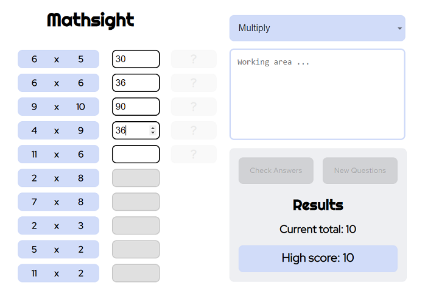
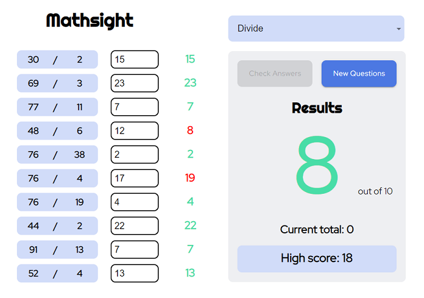
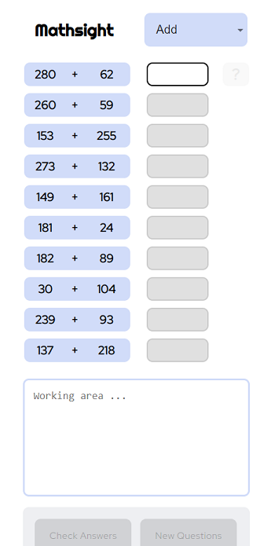

# math-sight
Simple math quiz app for kids [Typescript, ReactJS, local-storage, styled-components, Material-UI, mobile responsive]

Simple Mode: https://seren1ty.github.io/math-sight/#/s

Advanced Mode: https://seren1ty.github.io/math-sight/#/a

WIP - Custom Modes.

***

Mathsight contains a ReactJS/Typescript client project.

## How to Initialise / Run Project

To start the app, from the '<root_directory>/', you can run:

### `npm i`

Loads all dependencies into the node_modules directory, based on configuration in the <root_directory>/package.json.

### `npm run start`

Runs the app in development mode. 

Open Simple Mode [http://localhost:3000/math-sight#/s](http://localhost:3000/math-sight#/s) to view Simple Mode in the browser.

Open Advanced Mode [http://localhost:3000/math-sight#/a](http://localhost:3000/math-sight#/a) to view Advanced Mode in the browser.

The app will reload if you make edits.

***

Mathsigth is a kids math quiz app that presents 10 questions at a time, and allows selection between Simple/Advanced
questions via the url (see above), and selection of different operation types via an easy to use Select box. The operations are:
Add, Subtract, Multiply and Divide.

Local-storage is used to store, and display, the highest continuous run of correct answers, as well as the users current
number of correct answers in a row, so they can leave and come back later to continue trying to set a new high score.

A working area is also provided so the user can type any text/numbers that might assist with solving a question.

***

After completing all questions, the user can Check Answers to see both the correct answers and their scores.

***

App components are rearranged on small screens for better usability.

